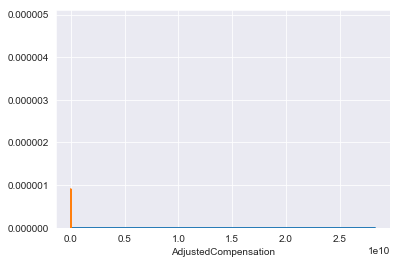

# In Depth A/B Testing - Lab

## Introduction

In this lab, you'll explore a survey from Kaggle regarding budding data scientists. With this, you'll form some initial hypotheses, and test them using the tools you've acquired to date. 

## Objectives

You will be able to:
* Conduct t-tests and an ANOVA on a real-world dataset and interpret the results

## Load the Dataset and Perform a Brief Exploration

The data is stored in a file called **multipleChoiceResponses_cleaned.csv**. Feel free to check out the original dataset referenced at the bottom of this lab, although this cleaned version will undoubtedly be easier to work with. Additionally, meta-data regarding the questions is stored in a file name **schema.csv**. Load in the data itself as a Pandas DataFrame, and take a moment to briefly get acquainted with it.

> Note: If you can't get the file to load properly, try changing the encoding format as in `encoding='latin1'`


```python
%load_ext autoreload
%autoreload 2
```


```python
#Your code here
import pandas as pd
import flatiron_stats as fstats
```


```python
df = pd.read_csv('multipleChoiceResponses_cleaned.csv', encoding='latin1')
df.head()
```

    /anaconda3/envs/learn-env/lib/python3.6/site-packages/IPython/core/interactiveshell.py:2785: DtypeWarning: Columns (1,2,3,4,5,6,7,8,9,10,11,12,13,14,15,16,17,18,19,20,21,22,23,24,25,26,27,28,29,30,31,32,33,34,35,36,37,38,39,40,41,42,43,44,45,46,47,48,49,50,51,52,53,54,55,56,57,58,65,66,67,68,69,70,71,72,73,74,75,76,77,78,79,80,81,82,83,84,85,86,87,88,89,90,91,92,93,94,95,96,97,98,99,100,101,102,103,104,105,106,107,108,109,110,111,112,113,114,115,116,117,118,119,120,121,122,123,124,125,126,127,128,129,130,131,132,133,134,135,136,137,138,139,140,141,142,143,144,145,146,147,148,149,150,151,152,153,154,155,156,157,158,159,160,161,162,163,164,165,172,173,174,175,176,177,178,179,180,181,182,183,184,185,186,187,188,189,190,191,192,193,194,195,196,197,198,199,200,201,202,203,204,205,207,208,209,210,211,212,213,214,215,216,217,218,219,220,221,222,223,224,225,226,227) have mixed types. Specify dtype option on import or set low_memory=False.
      interactivity=interactivity, compiler=compiler, result=result)


<div>
<style scoped>
    .dataframe tbody tr th:only-of-type {
        vertical-align: middle;
    }

    .dataframe tbody tr th {
        vertical-align: top;
    }

    .dataframe thead th {
        text-align: right;
    }
</style>
<table border="1" class="dataframe">
  <thead>
    <tr style="text-align: right;">
      <th></th>
      <th>GenderSelect</th>
      <th>Country</th>
      <th>Age</th>
      <th>EmploymentStatus</th>
      <th>StudentStatus</th>
      <th>LearningDataScience</th>
      <th>CodeWriter</th>
      <th>CareerSwitcher</th>
      <th>CurrentJobTitleSelect</th>
      <th>TitleFit</th>
      <th>...</th>
      <th>JobFactorTitle</th>
      <th>JobFactorCompanyFunding</th>
      <th>JobFactorImpact</th>
      <th>JobFactorRemote</th>
      <th>JobFactorIndustry</th>
      <th>JobFactorLeaderReputation</th>
      <th>JobFactorDiversity</th>
      <th>JobFactorPublishingOpportunity</th>
      <th>exchangeRate</th>
      <th>AdjustedCompensation</th>
    </tr>
  </thead>
  <tbody>
    <tr>
      <th>0</th>
      <td>Non-binary, genderqueer, or gender non-conforming</td>
      <td>NaN</td>
      <td>NaN</td>
      <td>Employed full-time</td>
      <td>NaN</td>
      <td>NaN</td>
      <td>Yes</td>
      <td>NaN</td>
      <td>DBA/Database Engineer</td>
      <td>Fine</td>
      <td>...</td>
      <td>NaN</td>
      <td>NaN</td>
      <td>NaN</td>
      <td>NaN</td>
      <td>NaN</td>
      <td>NaN</td>
      <td>NaN</td>
      <td>NaN</td>
      <td>NaN</td>
      <td>NaN</td>
    </tr>
    <tr>
      <th>1</th>
      <td>Female</td>
      <td>United States</td>
      <td>30.0</td>
      <td>Not employed, but looking for work</td>
      <td>NaN</td>
      <td>NaN</td>
      <td>NaN</td>
      <td>NaN</td>
      <td>NaN</td>
      <td>NaN</td>
      <td>...</td>
      <td>NaN</td>
      <td>NaN</td>
      <td>NaN</td>
      <td>NaN</td>
      <td>NaN</td>
      <td>Somewhat important</td>
      <td>NaN</td>
      <td>NaN</td>
      <td>NaN</td>
      <td>NaN</td>
    </tr>
    <tr>
      <th>2</th>
      <td>Male</td>
      <td>Canada</td>
      <td>28.0</td>
      <td>Not employed, but looking for work</td>
      <td>NaN</td>
      <td>NaN</td>
      <td>NaN</td>
      <td>NaN</td>
      <td>NaN</td>
      <td>NaN</td>
      <td>...</td>
      <td>Very Important</td>
      <td>Very Important</td>
      <td>Very Important</td>
      <td>Very Important</td>
      <td>Very Important</td>
      <td>Very Important</td>
      <td>Very Important</td>
      <td>Very Important</td>
      <td>NaN</td>
      <td>NaN</td>
    </tr>
    <tr>
      <th>3</th>
      <td>Male</td>
      <td>United States</td>
      <td>56.0</td>
      <td>Independent contractor, freelancer, or self-em...</td>
      <td>NaN</td>
      <td>NaN</td>
      <td>Yes</td>
      <td>NaN</td>
      <td>Operations Research Practitioner</td>
      <td>Poorly</td>
      <td>...</td>
      <td>NaN</td>
      <td>NaN</td>
      <td>NaN</td>
      <td>NaN</td>
      <td>NaN</td>
      <td>NaN</td>
      <td>NaN</td>
      <td>NaN</td>
      <td>1.0</td>
      <td>250000.0</td>
    </tr>
    <tr>
      <th>4</th>
      <td>Male</td>
      <td>Taiwan</td>
      <td>38.0</td>
      <td>Employed full-time</td>
      <td>NaN</td>
      <td>NaN</td>
      <td>Yes</td>
      <td>NaN</td>
      <td>Computer Scientist</td>
      <td>Fine</td>
      <td>...</td>
      <td>NaN</td>
      <td>NaN</td>
      <td>NaN</td>
      <td>NaN</td>
      <td>NaN</td>
      <td>NaN</td>
      <td>NaN</td>
      <td>NaN</td>
      <td>NaN</td>
      <td>NaN</td>
    </tr>
  </tbody>
</table>
<p>5 rows × 230 columns</p>
</div>


## Wages and Education

You've been asked to determine whether education is impactful to salary. Develop a hypothesis test to compare the salaries of those with Master's degrees to those with Bachelor's degrees. Are the two statistically different according to your results?

> Note: The relevant features are stored in the 'FormalEducation' and 'AdjustedCompensation' features.

You may import the functions stored in the `flatiron_stats.py` file to help perform your hypothesis tests. It contains the stats functions that you previously coded: `welch_t(a,b)`, `welch_df(a, b)`, and `p_value(a, b, two_sided=False)`. 

Note that `scipy.stats.ttest_ind(a, b, equal_var=False)` performs a two-sided Welch's t-test and that p-values derived from two-sided tests are two times the p-values derived from one-sided tests. See the [documentation](https://docs.scipy.org/doc/scipy/reference/generated/scipy.stats.ttest_ind.html) for more information.    


```python
df.FormalEducation.value_counts()
```


    Master's degree                                                      8204
    Bachelor's degree                                                    4811
    Doctoral degree                                                      3543
    Some college/university study without earning a bachelor's degree     786
    Professional degree                                                   451
    I did not complete any formal education past high school              257
    I prefer not to answer                                                 90
    Name: FormalEducation, dtype: int64


```python
df.CompensationAmount.dropna().describe()
```


    count    5.178000e+03
    mean     4.129494e+07
    std      1.965335e+09
    min     -9.900000e+01
    25%      5.000000e+04
    50%      9.000000e+04
    75%      1.900000e+05
    max      1.000000e+11
    Name: CompensationAmount, dtype: float64


```python
ed_ms = "Master's degree"
ed_ba = "Bachelor's degree"
ed_col = 'FormalEducation'
comp_col = 'AdjustedCompensation'
```


```python
df_ms = df_ms.dropna(subset=[ed_col, comp_col])
df_ms.info()
```

    <class 'pandas.core.frame.DataFrame'>
    Int64Index: 4342 entries, 3 to 26378
    Data columns (total 2 columns):
    FormalEducation         4342 non-null object
    AdjustedCompensation    4342 non-null float64
    dtypes: float64(1), object(1)
    memory usage: 101.8+ KB


```python
s1 = df_ms[df_ms[ed_col] == ed_ms][comp_col]
s2 = df_ms[df_ms[ed_col] == ed_ba][comp_col]
```


```python
print('Comparison of {} for {} and {}'.format(comp_col, ed_ms, ed_ba))
print("Median Values: \ts1: {} \ts2: {}".format(round(s1.median(),2), round(s2.median(),2)))
print("Mean Values: \ts1: {} \ts2: {}".format(round(s1.mean(),2), round(s2.mean(),2)))
print('Sample sizes: \ts1: {} \ts2: {}'.format(len(s1), len(s2)))
print("Welch's t-test p-value:", fstats.p_value_welch_ttest(s1, s2))
```

    Comparison of AdjustedCompensation for Master's degree and Bachelor's degree
    Median Values: 	s1: 53812.17 	s2: 38399.4
    Mean Values: 	s1: 69139.9 	s2: 64887.1
    Sample sizes: 	s1: 1990 	s2: 1107
    Welch's t-test p-value: 0.33077639451272445


```python
a = df_ms[df_ms.FormalEducation == "Bachelor's degree"]
b = df_ms[df_ms.FormalEducation == "Master's degree"]
```


```python
a.size, b.size
```


    (2214, 3980)


```python
a.head()
```


<div>
<style scoped>
    .dataframe tbody tr th:only-of-type {
        vertical-align: middle;
    }

    .dataframe tbody tr th {
        vertical-align: top;
    }

    .dataframe thead th {
        text-align: right;
    }
</style>
<table border="1" class="dataframe">
  <thead>
    <tr style="text-align: right;">
      <th></th>
      <th>FormalEducation</th>
      <th>AdjustedCompensation</th>
    </tr>
  </thead>
  <tbody>
    <tr>
      <th>8</th>
      <td>Bachelor's degree</td>
      <td>64184.800</td>
    </tr>
    <tr>
      <th>9</th>
      <td>Bachelor's degree</td>
      <td>20882.400</td>
    </tr>
    <tr>
      <th>11</th>
      <td>Bachelor's degree</td>
      <td>1483.900</td>
    </tr>
    <tr>
      <th>21</th>
      <td>Bachelor's degree</td>
      <td>20000.000</td>
    </tr>
    <tr>
      <th>25</th>
      <td>Bachelor's degree</td>
      <td>10858.848</td>
    </tr>
  </tbody>
</table>
</div>


```python
fstats.p_value_welch_ttest(a.AdjustedCompensation, b.AdjustedCompensation)
```


    0.33077639451272445


## Wages and Education II

Now perform a similar statistical test comparing the AdjustedCompensation of those with Bachelor's degrees and those with Doctorates. If you haven't already, be sure to explore the distribution of the AdjustedCompensation feature for any anomalies. 


```python
import matplotlib.pyplot as plt
import seaborn as sns
sns.set_style('darkgrid')
%matplotlib inline
```


```python
ed_phd = "Doctoral degree"
s1 = df_ms[df_ms[ed_col] == ed_phd][comp_col]
s2 = df_ms[df_ms[ed_col] == ed_ba][comp_col]
```


```python
sns.distplot(s1)
sns.distplot(s2)
```

    /anaconda3/envs/learn-env/lib/python3.6/site-packages/scipy/stats/stats.py:1713: FutureWarning: Using a non-tuple sequence for multidimensional indexing is deprecated; use `arr[tuple(seq)]` instead of `arr[seq]`. In the future this will be interpreted as an array index, `arr[np.array(seq)]`, which will result either in an error or a different result.
      return np.add.reduce(sorted[indexer] * weights, axis=axis) / sumval


    <matplotlib.axes._subplots.AxesSubplot at 0x1a1a84cc18>





```python
print("Median Values:")
print('s1: {}'.format(s1.median()))
print('s2: {}'.format(s2.median()))
print("Sample Sizes:")
print('s1: {}'.format(len(s1)))
print('s2: {}'.format(len(s2)))
print("Welch's T-test p-value: {}".format(fstats.p_value_welch_ttest(s1, s2)))
```

    Median Values:
    s1: 74131.91999999997
    s2: 38399.4
    Sample Sizes:
    s1: 967
    s2: 1107
    Welch's T-test p-value: 0.15682381994720251


```python
#Your code here
```

    Median Values: 
    s1:74131.92 
    s2:38399.4
    Sample sizes: 
    s1: 967 
    s2: 1107
    Welch's t-test p-value: 0.1568238199472023
    
    
    Repeated Test with Ouliers Removed:
    Sample sizes: 
    s1: 964 
    s2: 1103
    Welch's t-test p-value with outliers removed: 0.0


```python
s1_no_outliers = s1[s1 < 500000]
s2_no_outliers = s2[s2 < 500000]
```


```python
print("Median Values:")
print('s1: {}'.format(s1_no_outliers.median()))
print('s2: {}'.format(s2_no_outliers.median()))
print("Sample Sizes:")
print('s1: {}'.format(len(s1_no_outliers)))
print('s2: {}'.format(len(s2_no_outliers)))
print("Welch's T-test p-value: {}".format(fstats.p_value_welch_ttest(s1_no_outliers, s2_no_outliers)))
```

    Median Values:
    s1: 73152.77
    s2: 38292.15
    Sample Sizes:
    s1: 964
    s2: 1103
    Welch's T-test p-value: 0.0


## Wages and Education III

Remember the multiple comparisons problem; rather than continuing on like this, perform an ANOVA test between the various 'FormalEducation' categories and their relation to 'AdjustedCompensation'.


```python
from statsmodels.formula.api import ols
import statsmodels.api as sm
```


```python
#Your code here
formula = 'AdjustedCompensation ~ C(FormalEducation)'
lm = ols(formula, df_ms).fit()
table = sm.stats.anova_lm(lm, typ=2)
print(table)
```

                              sum_sq      df         F    PR(>F)
    C(FormalEducation)  6.540294e+17     6.0  0.590714  0.738044
    Residual            7.999414e+20  4335.0       NaN       NaN


```python
df_ms_no_outliers = df_ms[df_ms.AdjustedCompensation < 500000]
lm = ols(formula, df_ms_no_outliers).fit()
table = sm.stats.anova_lm(lm, typ=2)
print(table)
```

                              sum_sq      df          F        PR(>F)
    C(FormalEducation)  5.860266e+11     6.0  29.701947  4.496916e-35
    Residual            1.420249e+13  4319.0        NaN           NaN


Removing outliers above 500,000 then Education is a factor in adjusted compensation

## Additional Resources

Here's the original source where the data was taken from:  
    [Kaggle Machine Learning & Data Science Survey 2017](https://www.kaggle.com/kaggle/kaggle-survey-2017)

## Summary

In this lab, you practiced conducting actual hypothesis tests on actual data. From this, you saw how dependent results can be on the initial problem formulation, including preprocessing!
